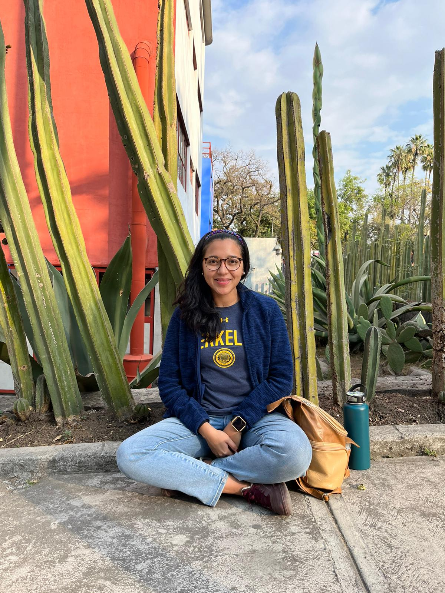

# Home

Hello, 

I'm a PhD Candidate in Demography at the University of California, Berkeley. My research focuses on Mexican emigration, primarily to the U.S., and how migrant characteristics have changed during this century. 

My dissertation explores the available data to study Mexican migration and focuses on differences by gender and by intentions to migrate.  
Specifically, I show how the Mexican Labor Force Survey (ENOE) is a useful source to understand timely change in migration (in and out) in Mexico, since it complements existing statistics from the Mexican Census and other household surveys.
My second chapter discusses how migrant selection has changed between 2005-2020 and how an important component is gender. Finally, my third chapter adds to the literature on intentions to migrate by focusing on how preparing to migrate may be indicative of future migration.

This fall, I will be on the academic Job Market. You can find my latest CV here. 

